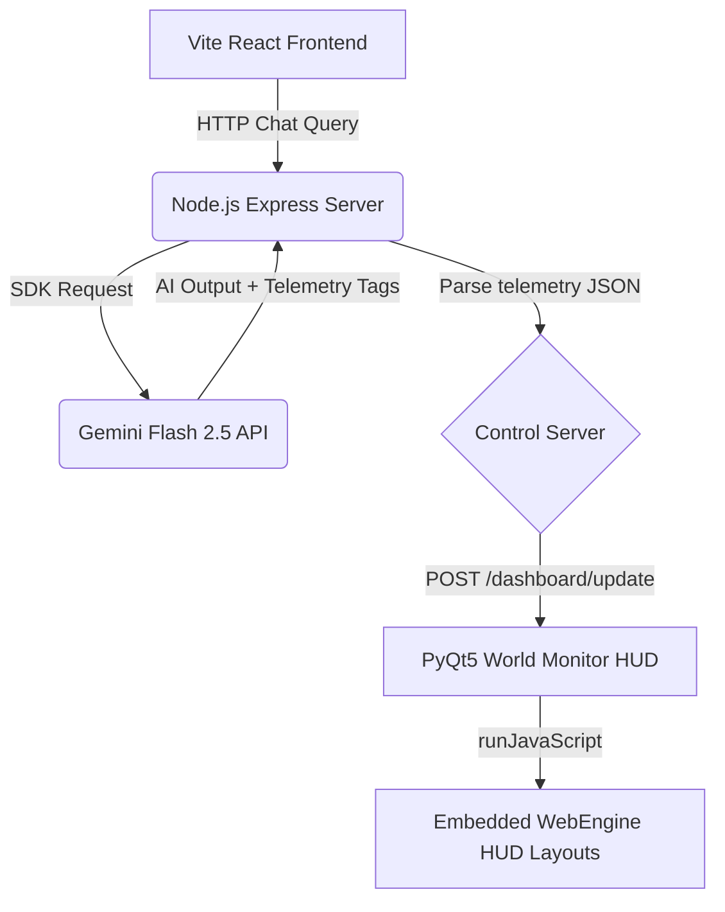

# ❄️ Snow OS // Dynamic AI Command Center

> A futuristic, context-aware personal AI assistant integrated with an interactive, telemetry-driven Head Up Display (HUD) command center.

---

## 🌟 Overview

**Snow OS** transforms the concept of standard AI chat interfaces into an adaptive, data-dense operations terminal. Powered by Gemini AI, the system dynamically pushes coordinate mappings, system logs, threat radars, and metric spectrum charts directly to a borderless PyQt5 Python dashboard in real-time, responding intelligently to user input.

```
+-----------------------------------------------------------+
|                                                           |
|    +-------------------+         +-------------------+    |
|    |                   |         |  SYSTEM SCROLL    |    |
|    |                   |         +-------------------+    |
|    |    LEAFLET MAP    |         |  THREAT RADAR     |    |
|    |    (Global Grid)  |         +-------------------+    |
|    |                   |         |  ORBITAL SWEEP    |    |
|    |                   |         +-------------------+    |
|    |                   |         |  CORE DENSITY     |    |
|    +-------------------+         +-------------------+    |
|                                                           |
+-----------------------------------------------------------+
```

---

## 🚀 Key Features

*   **🎙️ Typewriter AI Companion (Snow)**: A warm, charming, and conversational AI built with custom instructions to deliver premium spoken and visual responses.
*   **📡 Hands-Free Map Telemetry**: Dynamic coordinate mapping utilizing Leaflet.js with CartoDB DarkMatter tiles. Pulse markers feature permanent floating tooltip overlays indicating node names (e.g. Cupertino HQ, Tokyo Hub) without requiring manual interaction.
*   **📊 Live HUD Instrumentation**:
    *   **Monitor 01: System Scroll**: Live scrolling network/news timeline showing diagnostic feeds.
    *   **Monitor 02: Threat Radar**: A HTML5 canvas sweeping security tracker.
    *   **Monitor 03: Orbital Sweep**: Geostationary altitude tracking telemetry.
    *   **Monitor 04: Core Density**: Real-time canvas line chart displaying spectrum levels.
*   **🔌 Bidirectional API Bridge**: Thread-safe communication between the Node.js Express backend and PyQt5/PyQtWebEngine GUI window over a local HTTP Control API.
*   **🛡️ Resilient Offline Failover**: Seamless automatic local mock fallback whenever the Gemini API key is rate-limited (`429`) or overloaded (`503`), keeping the client fully responsive.

---

## 🏗️ Architecture



---

## 🛠️ Installation & Setup

### Prerequisites

*   **Node.js** (v18+)
*   **Python 3.12+**
*   **PyQt5** & **PyQtWebEngine**

### 1. Clone & Install Dependencies

```bash
# Install Node modules
npm install

# Install Python UI packages
pip3 install PyQt5 PyQtWebEngine
```

### 2. Configure Environment

Create a `.env` file in the root directory:

```env
PORT=3000
GEMINI_API_KEY=your_gemini_api_key_here
```

### 3. Build & Run in Development

```bash
# Build Vite client and start tsx watch server
npm run build
npm run dev
```

---

## ⚙️ How it Works

1.  **AI Detection**: Every message sent to the assistant is intercepted.
2.  **Tag Parsing**: The backend searches for the `[UI_MONITOR_DATA: <JSON>]` tag.
3.  **Auto-Show**: The system automatically executes `python3 world_monitor.py` and opens the HUD if telemetry data is present.
4.  **GUI Injection**: The Node server pushes the JSON package over to port `8085`. PyQt5 executes `runJavaScript()` inside the browser components to repaint the map, scroll logs, and graph canvases instantly.

---

## 🎨 System Rendering & Compatibility Fixes

The world monitor incorporates critical rendering configurations to ensure 100% stability under Linux X11/Wayland compositors:
*   `Qt.AA_ShareOpenGLContexts` set to prevent Chromium context crashes.
*   `--disable-gpu-compositing` to prevent borderless window rendering lock-ups.
*   Explicit dark palette styling to prevent white flashing on startup.
